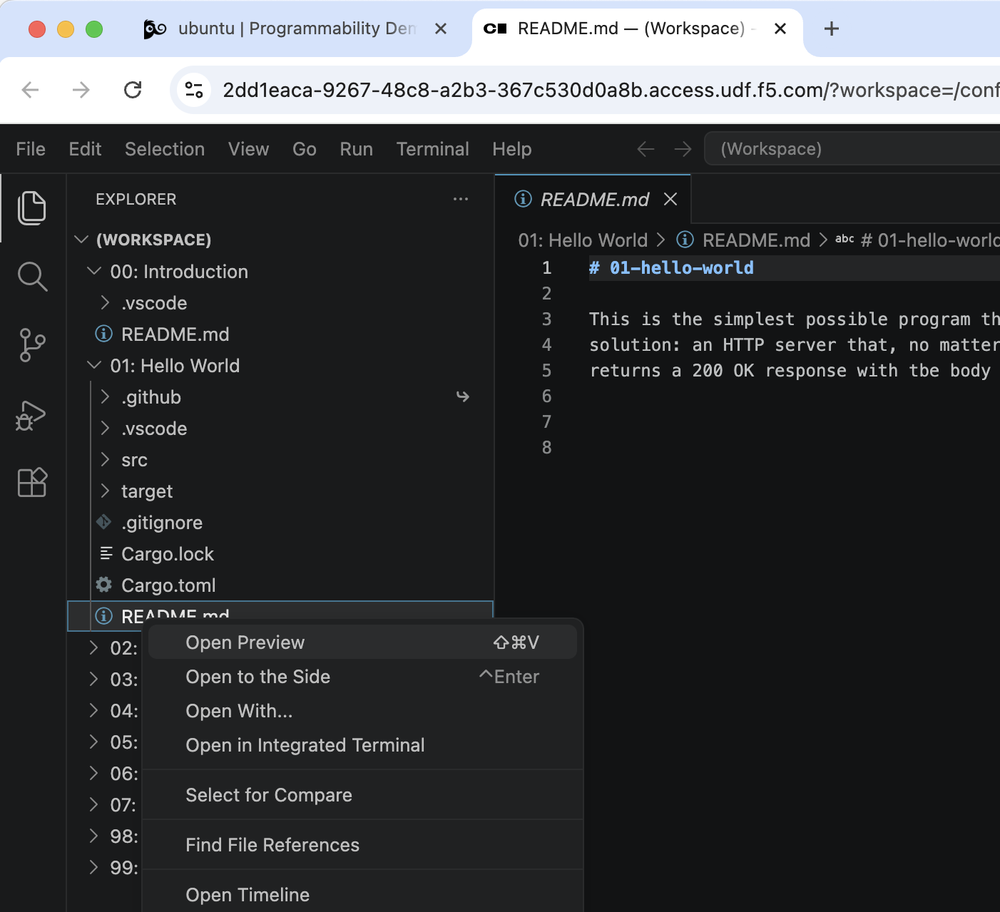
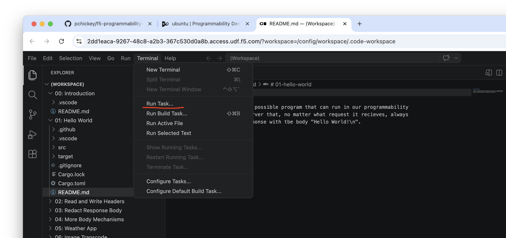
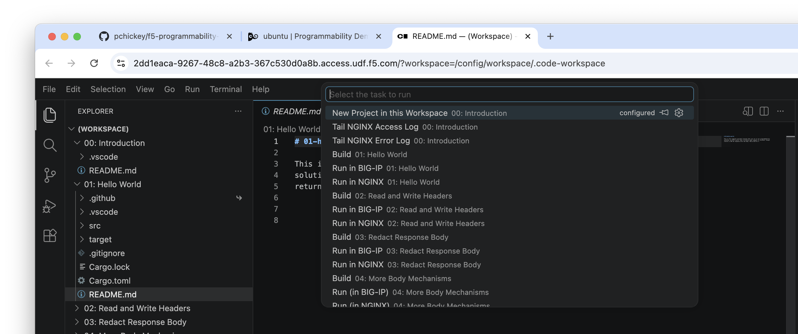

# Introduction

## Using VS Code

When prompted, tell VS Code you trust the authors of the workspace.

Once in VS Code, there are a set of folders in the workspace, corresponding
to the folders in this repository. Each contains a README.md describing the
contents. Use the right click "Open Preview" on these README.md files to
render them nicely:

Each folder has a set of Tasks configured to be run by VS Code for building
and deploying the example.

In the `Terminal` menu, select `Run Task`:

Then, each available Task is available in the selector:

