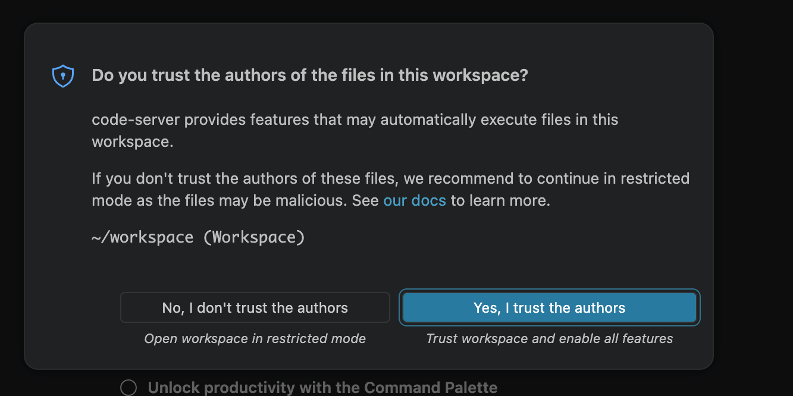
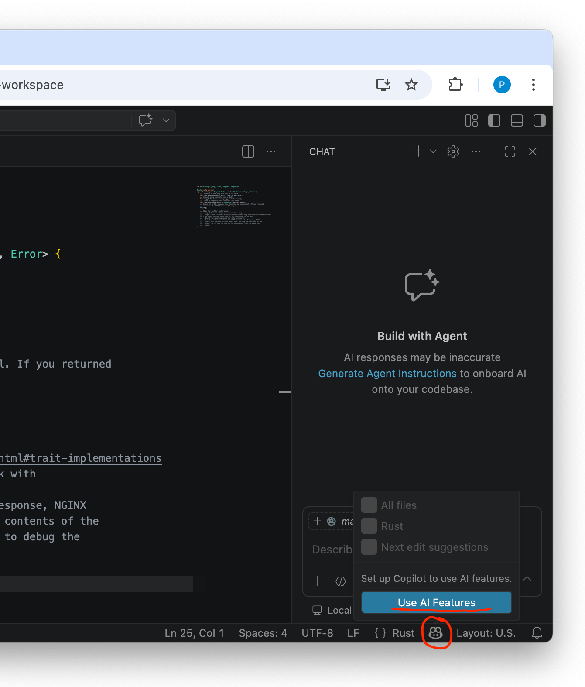

# Introduction

## Using VS Code

When first opening VS Code, click Yes, you trust the authors of the workspace.



### Rendering READMEs

Once in VS Code, there are a set of folders in the workspace, corresponding
to the folders in this repository. Each contains a README.md describing the
contents. Use the right click "Open Preview" on these README.md files to
render them nicely:


### Running Tasks

Each folder has a set of Tasks configured to be run by VS Code for building
and deploying the example.

In the `Terminal` menu, select `Run Task`:


Then, each available Task is available in the selector:


This `00: Introduction` folder has some special tasks for viewing NGINX's logs
in a terminal, and for creating a new folder.

All other folders have an identical set of tasks for building the program,
and running it on NGINX and BIG-IP.

### Getting LLM Assistance: Copilot

All of the programs in this repository are written in the Rust language.
(Other languages will be available in the future.) If you don't know the Rust
language, LLMs have gotten pretty ok at writing Rust for you, and we have
included context and agent files in this repository to help LLMs understand
the particulars of the Wasm Programmability environment.

Click the Copilot icon on VS Code's bottom bar, and then click "Use AI
Features".



Then, follow the instructions to authorize VS Code to access your GitHub
account.

Then, with a source file from one of the folders open, you can write prompts
to have an LLM modify the code for you. In this example, I prompted the LLM to
change the Hello World example:


```
Change the response body to be "Hello world! The current time is: " and then the current time.
```

and, after a few seconds, got the following results:


You can then use the Run task to build and run the changed program in NGINX,
and then use curl in the terminal (or the UDF link for NGINX Default Service
in your browser) to see the results:


### Saving your work

Your UDF deployment will only persist for a couple of hours, and once it is
destroyed, all changes you made in VS Code will be erased with it. We
recommend you use a GitHub repository to save your work.

The VS Code workspace is a git repository that has been cloned from
[https://github.com/pchickey/f5-programmability-demos-may2026](https://github.com/pchickey/f5-programmability-demos-may2026). Using your GitHub account, make your own fork of this repository.

Then, you'll need to use the Terminal feature to:

* Configure git with your username, e.g.
```sh
$ git config --global user.name "John Doe"
$ git config --global user.email johndoe@example.com
```
* [Generate an SSH
key](https://docs.github.com/en/authentication/connecting-to-github-with-ssh/generating-a-new-ssh-key-and-adding-it-to-the-ssh-agent) and [add the pubkey to your GitHub account](https://docs.github.com/en/authentication/connecting-to-github-with-ssh/adding-a-new-ssh-key-to-your-github-account)
* Change the origin remote to your own fork, commit a change, and push:
```sh
$ git remote set-url origin git@github.com:YOURUSERNAME/f5-programmability-demos-may2026
$ echo "changes" >> README.md
$ git co -a -m"changes made on UDF"
$ git push origin main
```

### Restoring your work

Follow the instructions for in the previous section for configuring git,
creating an ssh key, and adding to your GitHub account.

Then, change the origin remote to your own fork, fetch your changes, and reset
the main branch to point at your fork's main.

```sh
$ git remote set-url origin git@github.com:YOURUSERNAME/f5-programmability-demos-may2026
$ git fetch origin
$ git reset --hard origin/main
```

## A WebAssembly Primer

All programs running on the new Wasm Programmability platform are compiled to
WebAssembly, and uses imports from the WASIp2 HTTP Proxy world. WebAssembly is
an instruction set, and WASIp2 is a W3C-standardized interface to an operating
system. Because the WASIp2 operating system is based off of the [WebAssembly
Component Model], we call compiled programs Components.

The WASIp2 operating system has many implementations. A popular
open-source implementation, maintained by a team of contributors including
your author, is included in the [Wasmtime] project. In addition to F5's
implementations of WASIp2, other vendors, such as Fastly and Akamai, also offer
platforms based on WASIp2.

[WebAssembly Component Model]: https://component-model.bytecodealliance.org/
[Wasmtime]: https://github.com/bytecodealliance/wasmtime

Unlike a monolith operating system such as Windows or Linux, WASIp2
implementations can provide different subsets of functionality. One of these
subsets is known as the [WASI-HTTP Proxy world], which provides a set of
interfaces for sending and recieving HTTP requests and responses.

[WASI-HTTP Proxy world]: https://github.com/WebAssembly/WASI/tree/main/proposals/http

Another way that WASIp2 is unlike traditional operating systems is that it
provides a higher-level, structured interfaces to the HTTP protocol, instead
of using network sockets. This allows for a safe, efficient implementation on
top of existing HTTP dataplanes, including NGINX and BIG-IP.

A WebAssembly Component for the WASI-HTTP Proxy world exports a function that
can read an incoming HTTP request, and provide the corresponding HTTP
response. It also imports functions which are used to make outbound HTTP
requests, and read their responses.

There are a handful of different tools for reading and exploring the WASI-HTTP
interfaces. One reasonably nice one is
[https://wa.dev/wasi:http](https://wa.dev/wasi:http).

### Using the `wstd` Library

All of the programs in this repo use the `wstd` crate, which is maintained by
your author. You can pronounce it aloud however you like, but I say it like
"Dub Stood".

The best way to start learning what is in `wstd` is to [start reading the docs
on docs.rs][wstd-docs]. All open-source Rust crates published to
[crates.io](https://crates.io), Rust's central package repository, have docs
available on [docs.rs](https://docs.rs). You can also always build and browse
the docs for a given Rust project, and all of its dependencies, by running
`cargo doc --open` in any directory containing Rust source code.

[wstd-docs]: https://docs.rs/wstd/latest/wstd/index.html

wstd provides async Rust abstractions for the WASIp2 operating system.
Everything the [`wstd::http`] module provides will work on F5's Wasm
Programmability platform. However, not everything in wstd will work on F5's
Wasm Programmability platforms at this time. TCP networking, provided by
[`wstd::net`], is not yet supported.

[`wstd::http`]: https://docs.rs/wstd/latest/wstd/http/index.html
[`wstd::net`]: https://docs.rs/wstd/latest/wstd/net/index.html

The F5 Wasm Programmability platform only supports programs with an entry
point (aka export function) defined by the `wstd::http_server` macro:

```rust
#[wstd::http_server]
async fn main(req: Request<Body>) -> Result<Response<Body>, Error> {
    todo!()
}
```

Using an entrypoint defined by `wstd::main` will not work.

#### Wstd and the Rust HTTP Ecosystem

`wstd::http` is designed to interoperate with the Rust HTTP ecosystem as much
as possible.

The `Request`, `Response`, `HeaderMap`, `HeaderName`, `HeaderValue`, and other
related types are all provided by the [Rust `http` crate], which provides a
common set of types used by many different HTTP implementations.

The [`Body` struct] is defined locally in wstd and has a handful of useful methods of its own.
Additionally, it is designed to interoperate with the (admittedly, confusingly
named) [`http-body` crate]'s [`Body` trait], via [`Body::into_boxed_body`] and
[`Body::from_http_body`].

[Rust `http` crate]: https://docs.rs/http/latest/http/
[`Body` struct]: https://docs.rs/wstd/latest/wstd/http/struct.Body.html
[`http-body` crate]: https://docs.rs/http-body/latest/http_body/
[`Body` trait]: https://docs.rs/http-body/latest/http_body/trait.Body.html
[`Body::into_boxed_body`]: https://docs.rs/wstd/latest/wstd/http/struct.Body.html#method.into_boxed_body
[`Body::from_http_body`]: https://docs.rs/wstd/latest/wstd/http/struct.Body.html#method.from_http_body

By using the `http` and `http-body` ecosystem, wstd is able to interoperate
with a wide range of other crates in the Rust http ecosystem, including:

* The [axum] HTTP routing and request-handling library
* The [AWS SDK for Rust] ([more])


[axum]: https://docs.rs/axum/latest/axum/
[AWS SDK for Rust]: https://aws.amazon.com/sdk-for-rust/
[more]: https://github.com/bytecodealliance/wstd/tree/main/aws-example

### Communicating between programs

Each time the Wasm Programmability platform gets a new HTTP request, it will
create a new instance of the WebAssembly component, and call this entry point.
Once this call has finished responding and returns, the instance is destroyed.

This means that handling each request is isolated: changes to e.g. static
variables inside your program can only be observed by the instance that
changed them.

This also means that, if your program needs to share state with other
executions of itself (or with other programs) it must do so explicitly by
calling import functions provided by the host.

In addition to being able to use the HTTP client provided by the WASI-HTTP
interfaces, F5's Wasm Programmability offers access to a local key-value
store. On BIG-IP this store is backed by the [session
table](https://clouddocs.f5.com/api/irules/session.html), and on NGINX this
will be backed by the [`njs` shared
dictionary](https://github.com/nginx/njs-examples#shared-dictionary).

This repository provides an abstraction over F5's own key-value store
interface [in the `98-kv-store` folder]. This interface not part of the WASIp2
standard and therefore will not work on non-F5 WASIp2 implementations.

[in the `98-kv-store` folder]: https://github.com/pchickey/f5-programmability-demos-may2026/blob/main/98-kv-store/src/lib.rs#L37-L69
