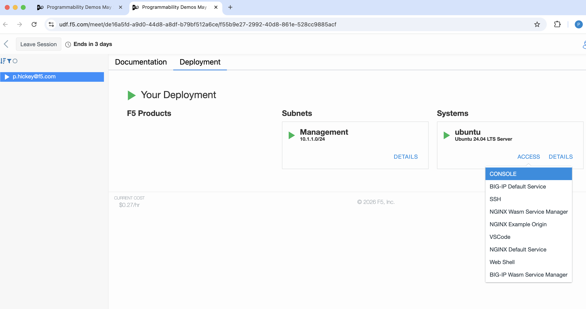

# F5 Programmability Demos: May 2026

These are a collection of example programs and demos from F5's Programmability
team. They are intended to be used by select F5 customers.

These programs are to run on an early-access version of F5's dataplanes with
Wasm Programmability enabled, provided to select customers and partners on the
[UDF](https://udf.f5.com/info). If you're interested in access, please
inqiurire with your F5 sales representative - I am unable to grant anyone
access directly.

## UDF Contents

To start, you'll need to deploy the UDF Blueprint [Programmability Demos May 2026](https://udf.f5.com/b/a6000fc9-9d73-47c2-a151-279917225a80#documentation).

On your deployment, select "Components", then under "Systems" there is a
single Ubuntu system. Click "DETAILS" on that system. You will then have a set
of buttons for accessing different services running on the Ubuntu host:




### Development environment: Visual Studio Code

This Ubuntu host provides a browser-based Visual Studio Code development
environment, where this repository is cloned as the workspace. You can open
this by clicking the button labeled "VSCODE".

More information on using VS Code in [Introduction/README.md][intro-readme].

[intro-readme]: https://github.com/pchickey/f5-programmability-demos-may2026/blob/main/00-introduction/README.md

### NGINX with Wasm Programmability

The Ubuntu host is running open-source NGINX, and includes F5's prototype Wasm
Programmability module `nginx-wasm`.

You can access NGINX's default Wasm service by clicking the button `NGINX WASM
DEFAULT SERVICE`. It is available on the UDF network at `10.1.1.4:8000`.

Additionally, NGINX is running an "Example Origin" Wasm service, accessible by
clicking the button `NGINX WASM EXAMPLE ORIGIN`. It is available on the UDF
network at `10.1.1.4:8001`. Many of the other programs hard-code this address
to make requests to this service.

The source code for the Example Origin is in this repository, but you don't
have to build and deploy it unless you want to make modifications - it is
already running by default.

### BIG-IP with Wasm Programmability

The Ubuntu host is also running BIG-IP with F5's prototype Wasm
Programmability integration. The particular BIG-IP running is based on BNK,
and it is executing inside engineering-only Docker based machinery.

There is no TMOS running on this system providing any associated BIG-IP
control plane or features, and the BIG-IP is not configurable beyond through
use of its prototype Wasm Control Plane.

The BIG-IP's default Wasm service is available on a network private to the
Ubuntu host at `10.254.1.2:3000`.

There is a trivial NGINX providing a transparent proxy of this BIG-IP service
to the UDF network at `10.1.1.4:3000`.

You can access this service over the UDF's internet bridge by clicking the
button `BIG-IP DEFAULT SERVICE`. Note that this access does proxy through
NGINX.

A major restriction of this BIG-IP is that it **cannot reach services running on
the `10.1.1.x` subnet**. This means that any demo programs using the NGINX
Example Origin service **will not work**. We have called this out in the README
of each relevant folder.

The key-value store accessible by Wasm Programmability is implemented using
the BIG-IP session table, so it will be able to read and write the same values
as you can access using iRules. However, in this demo environment, we do not
support adding iRules to the BIG-IP.

### Wasm Control Plane: Platypus

The UDF loads Wasm programs into each dataplane using `platypus`, a prototype
control plane implementation for Wasm Programmability. Platypus provides an
web API, as well as a web browser frontend, for managing which Wasm services
are running on the associated dataplane.

Platypus is not intended to represent what a production control plane will
look like - its a minimum viable prototype that is just for early access
experimentation.

The platypus instance for NGINX is available in the UDF by clicking the button
labeled `NGINX WASM SERVICE MANAGER`. Internally to the UDF deployent, it is
running at `10.1.1.4:9000`.

The platypus instance for BIG-IP is available in the UDF by clicking the button
labeled `BIG-IP WASM SERVICE MANAGER`. Internally to the UDF deployent, it is
running at `10.1.1.4:9001`.

If you don't want to use the web browser frontend, you can use the API using
curl or whatever else you like. You can do so via the UDF domain, or, in these
examples, locally on the ubuntu host using the VS Code terminal.

Get a listing of the services with `GET /services`:
```
curl http://10.1.1.4:9000/services | jq
```

Start running a new service with `POST /services`:
```
curl http://10.1.1.4:9000/services?name=put-a-name-here --binary-data "@path/to/your.wasm" 
```

## Bugs

Everyting you use here is prototype quality software, and does not yet meet
our quality bar for production use. In both the NGINX and BIG-IP dataplane
integrations, there are many known bugs.

Please do report bugs to the author as you encounter them.

## Author

Pat Hickey

Sr Principal Software Development Engineer

`p.hickey@f5.com`

With help from: Daniel Edgar, Javier Evans, Oscar Spencer, Chris Fallin, and
Nick Fitzgerald


